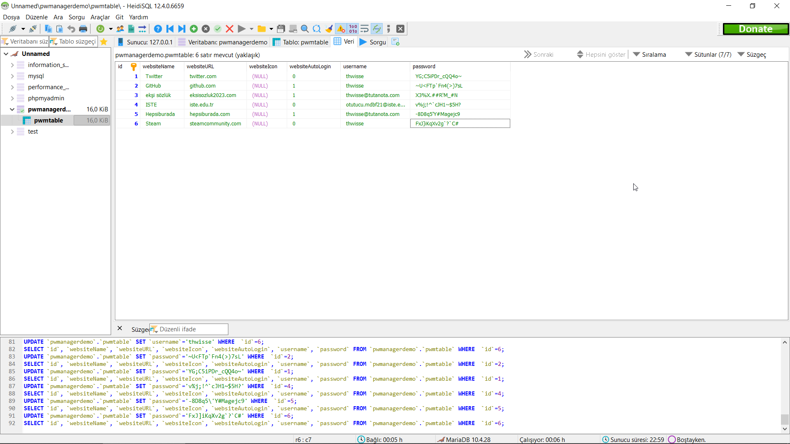

# Oğuzhan Tutucu / 212523033
# Donem Projesi

## Proje Hakkinda

### Projenin Amaci ve Motivasyonu:

Bu projede basit bir sifre yoneticisi yaptim. Kullanicilar uye oldugu sitelerde kullandiklari kullanici isimlerini ve sifrelerini unutmamalari icin bu uygulamayi kullanabilirler. Bununla birlikte 8 ila 18 karakter arasinda diledikleri harf ve ifadeleri secerek yeni karmasik parolalar uretebilir ve bunlari da sifre havuzuna kolayca ekleyebilirler.

### Projede Kullanilan Veritabani Tablom:

Projede tek bir tablo kullandim. 
HeidiSQL ve XAMPP programlarindan faydalandim.

